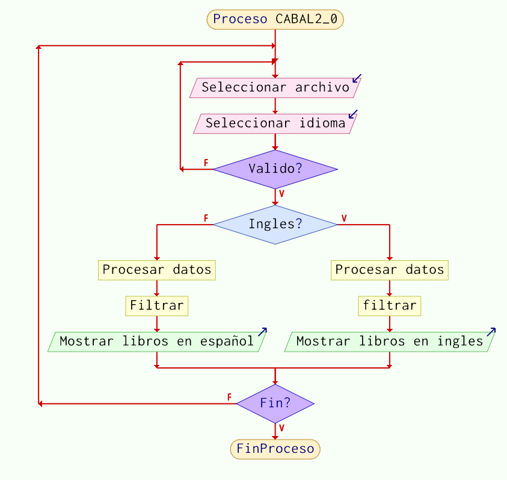

# CABAL2.0 📖 
🚀 Descripción del Proyecto
Aplicación Windows Forms en C# que procesa archivos de texto (.txt) con datos de libros, filtra por idioma (Español/Inglés) y muestra los resultados en una interfaz gráfica.

🔧 Requisitos
.NET Framework 4.7.2 o superior.

Visual Studio 2019/2022 (recomendado).

## 🧠 Pseudocódigo General

INICIO
    // 1. Configuración inicial
    Crear instancia de Procesador (inyección de dependencias)
    Inicializar Form1 con el Procesador

    // 2. Flujo principal (Form1)
    MÉTODO Form1_Load:
        Agregar paneles a la lista
        Mostrar panel inicial (selección de idioma)
        Actualizar visibilidad de botones

    MÉTODO btnBuscar_Click:
        Abrir diálogo para seleccionar archivo .txt
        SI archivo válido Y idioma seleccionado ENTONCES
            Procesar archivo (Procesador.DataTableFromTextFile)
            Mostrar datos en DataGridView
        SINO
            Mostrar error
        FIN SI

    MÉTODO btnContinuar_Click:
        Validar campos
        SI válido ENTONCES
            Mostrar siguiente panel (visualización de datos)
        FIN SI

    MÉTODO BtnVolver_Click:
        Limpiar DataGridView
        Mostrar panel anterior

    // 3. Lógica de Procesador
    MÉTODO DataTableFromTextFile(ruta, delimitador, idiomaFiltro):
        LEER archivo línea por línea (StreamReader)
        FILTRAR líneas por idioma (LINQ)
        CONVERTIR líneas a DataTable
        RETORNAR DataTable
FIN

## 📂 Estructura del Código
plaintext
Cabal2.0/
├── IProcesador.cs            // Interfaz para procesamiento
├── Procesador.cs             // Lógica de filtrado y conversión
├── Form1.cs                  // Interfaz gráfica y eventos
├── Program.cs                // Punto de entrada (inyección de dependencias)
└── README.md                 // Documentación

## 🔄 Flujo de Trabajo
Selección de Archivo:

El usuario elige un archivo .txt y un idioma.

El programa valida que los campos no estén vacíos.

Procesamiento:

Procesador lee el archivo, filtra por idioma y convierte los datos a DataTable.

Visualización:

Los resultados se muestran en un DataGridView.

Navegación:

Botones "Continuar" y "Volver" permiten moverse entre paneles.

## 📊 Diagrama de Flujo Simplificado

